# Tugas 1

Nama    : Tifanni Diva Auliya  
NIM     : 1203210027

1. Download dan install ubuntu 22.04 dari Microsoft store
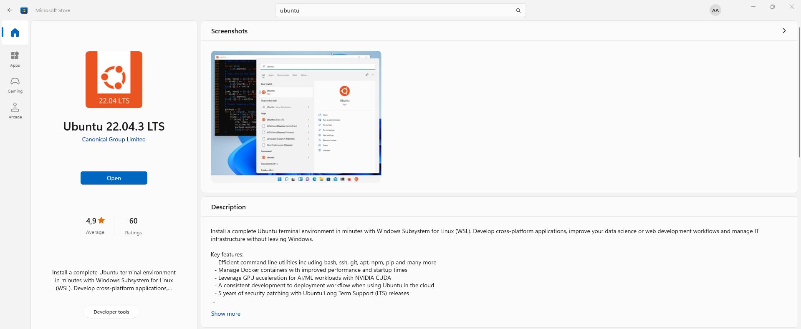

2. Klik kanan icon windows dan buka terminal (admin)  
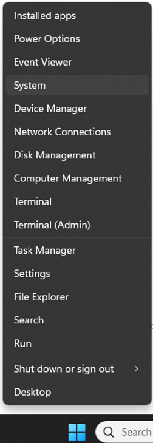

3. Masuk ke ubuntu dan buat username dan password

4. Jalankan Command berikut untuk menginstall paket yang dibutuhkan

```
sudo apt install -y build-essential linux-headers-$(uname -r)
```

5. Ubah ubuntu source list menjadi seperti dibawah

```
sudo nano /etc/apt/source.list"
```

```
deb http://archive.ubuntu.com/ubuntu/ jammy main restricted universe multiverse
deb-src http://archive.ubuntu.com/ubuntu/ jammy main restricted universe multiverse

deb http://archive.ubuntu.com/ubuntu/ jammy-updates main restricted universe multiverse
deb-src http://archive.ubuntu.com/ubuntu/ jammy-updates main restricted universe multiverse

deb http://archive.ubuntu.com/ubuntu/ jammy-security main restricted universe multiverse
deb-src http://archive.ubuntu.com/ubuntu/ jammy-security main restricted universe multiverse

deb http://archive.ubuntu.com/ubuntu/ jammy-backports main restricted universe multiverse
deb-src http://archive.ubuntu.com/ubuntu/ jammy-backports main restricted universe multiverse

deb http://archive.canonical.com/ubuntu/ jammy partner
deb-src http://archive.canonical.com/ubuntu/ jammy partner
```

6. Lakukan update

```
sudo apt update
```

```
sudo apt upgrade -y
```

7. Install lxc

```
sudo apt-get install lxc lxctl lxc-templates net-tools
```

8. Cek config lxc dan pastikan semua enabled

```
sudo lxc-checkconfig
```

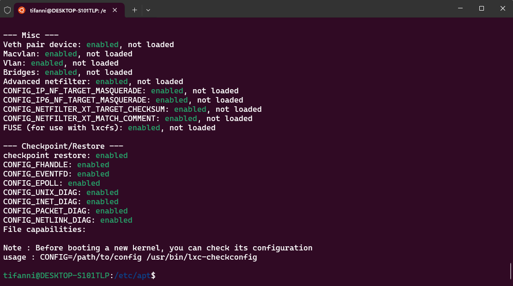

9. Install nginx

```
sudo apt install nginx nginx-extras
```

10.	Pergi ke direktori /etc/nginx/sites-enabled/ dan copy paste file default sebagai sister.local

```
cd /etc/nginx/sites-enabled
```

```
sudo cp default sister.local
```

11. Edit sister.local

```
sudo nano sister.local
```

```
server {
        listen 80;
        listen [::]:80;

        server_name sister.local;

        root/var/www/html;
        index index.html;

        location / {
            try_files $uri $uri/ =404
        }
}
```

12.	Pergi ke direktori /var/www/html/ dan copy paste file index.nginx-demian.html sebagai index.html

```
cd /var/www/html/
```

```
sudo cp index.nginx-debian.html index html
```

13. Edit index.html

```
sudo nano index.html
```

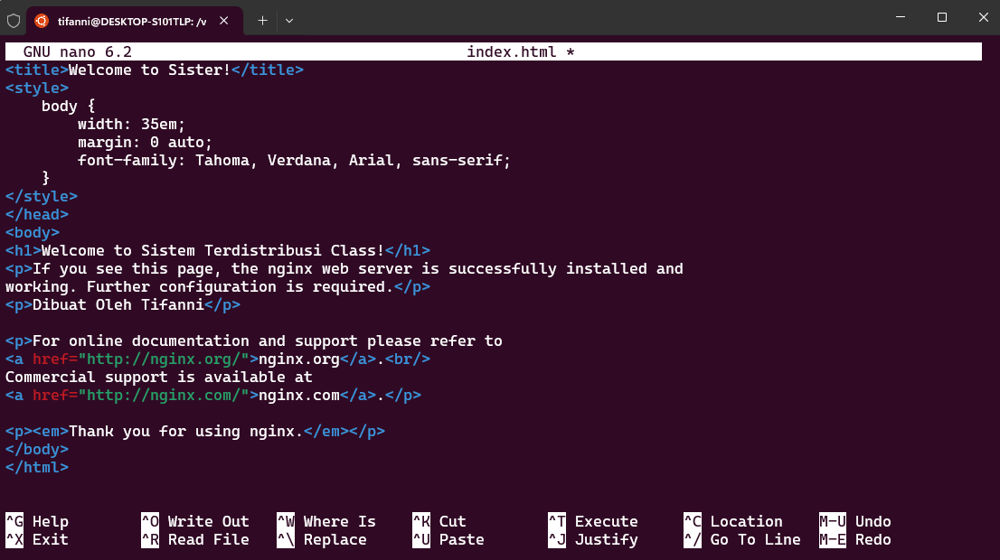

14.	Buka notepad sebagai administrator dan open file yang Bernama host di folder C:\Windows\System32\drivers\etc

15.	Tambahkan “127.0.0.1 sister.local” di akhir file dan save
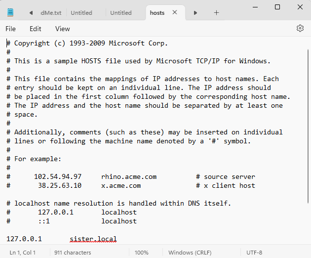

16.	Coba buka sister.local di browser
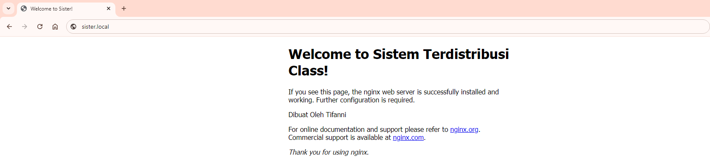

# Microservice1 dan Microservice2

1. Buat lxc yang Bernama microservice1 menggunkan ubuntu 20 untuk blog dan microservice2 menggunakan ubuntu untuk about us

```
sudo lxc-create -n microservice1 -t download -- --dist ubuntu --release focal --arch amd64 --force-cache --server images.linuxcontainers.org
```

```
sudo lxc-create -n microservice2 -t download -- --dist ubuntu --release bionic --arch amd64 --force-cache --server images.linuxcontainers.org
```

2. Jalankan dan attach kedua container lalu set sebuah password

```
sudo lxc-start -n microservice1
sudo lxc-attach -n microservice1
```

```
sudo lxc-start -n microservice2
sudo lxc-attach -n microservice2
```

3. Edit file 10-lxc.yaml

```
sudo nano /etc/netplan/10-lxc.yaml
```

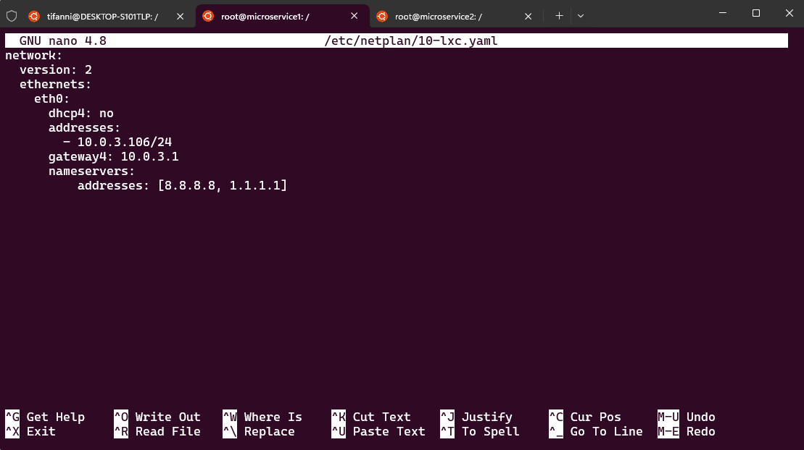

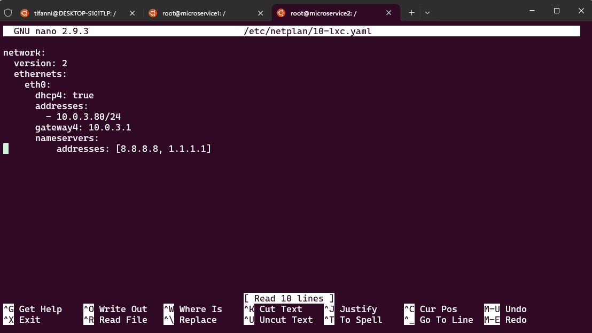

4. Terapkan netplannya

```
sudo netplan apply
```

5. Jalankan update

```
apt update; apt upgrade -y
```

6. Install nginx and start the nginx server

```
sudo apt install nginx nginx-extras
```

```
sudo systemctl start nginx
```

7. Pergi ke direktori /var/www/html dan copy paste index.nginx-debian.html sebagai index.html dan edit file tersebut

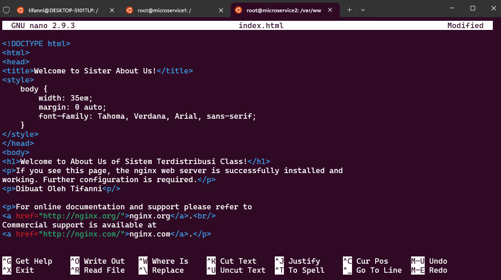

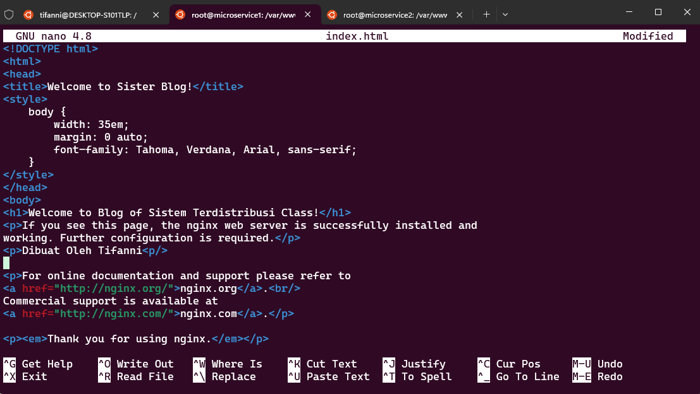

8. Pergi ke direktori /etc/nginx/sites-enabled/ dan copy paste file default sebagai mcsv1.local dan mcsv2.local dan edit file tersebut kedua file tersebut

```
cd /etc/nginx/sites-enabled/
```

```
cp default mcsv1.local

cp default mcsv2.local
```

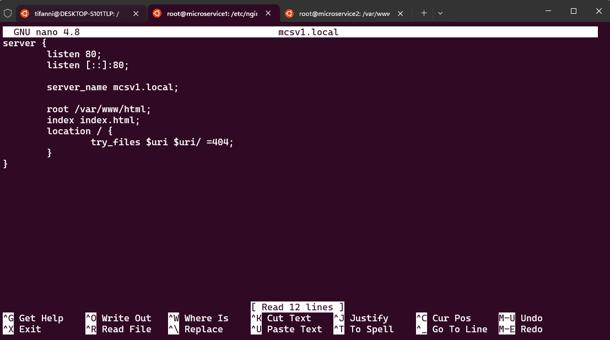

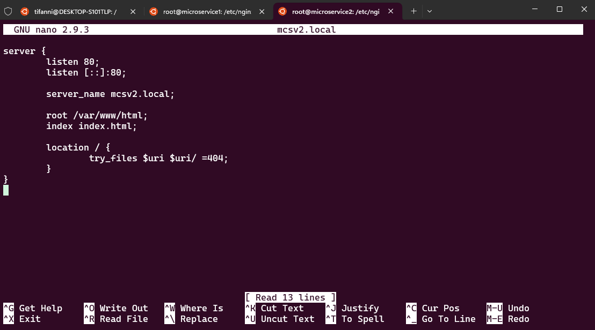

9. Tambahkan mcsv1.local dan mcsv2.local ke hosts

```
sudo nano /etc/hosts
```

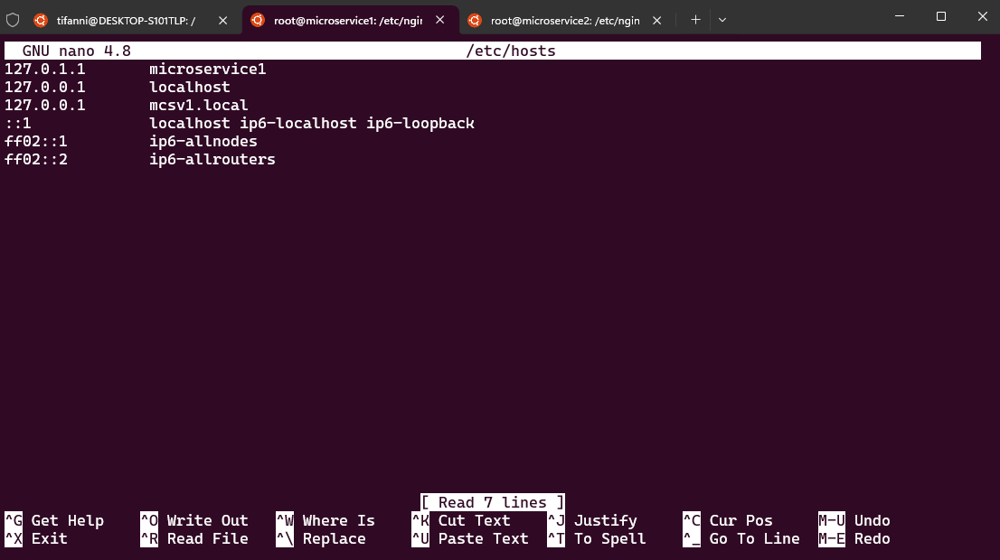

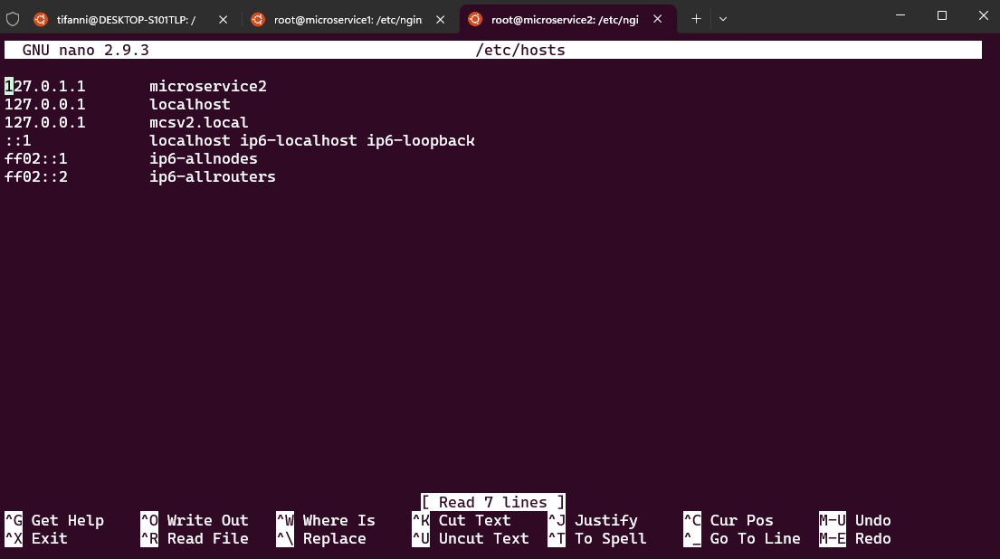

10. Tambahkan mcsv1.local dan mcsv2.local ke hosts parent

```
sudo nano /etc/hosts
```

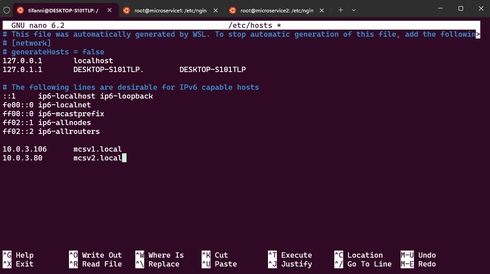

11. Pergi ke direktori /etc/nginx/sites-enabled/ dan edit sister.local

```
sudo nano /etc/nginx/sites-enabled/sister.local
```
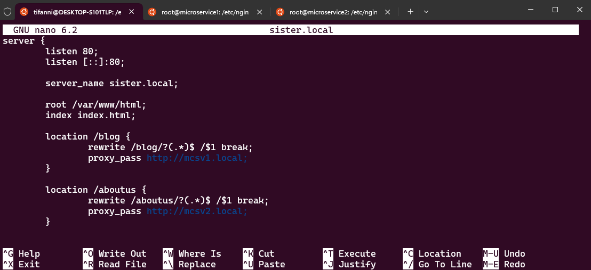

12. Coba buka sister.local/blog dan sister.local.about di browser

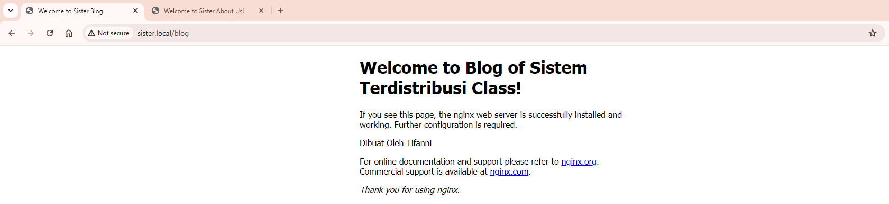

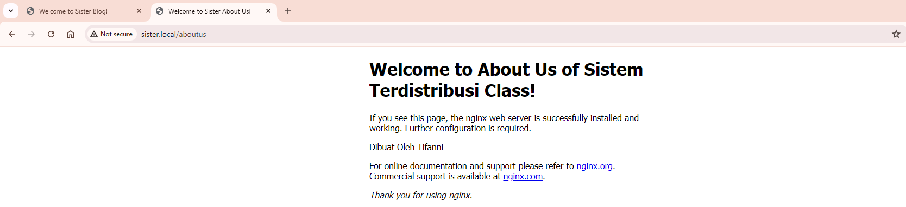


